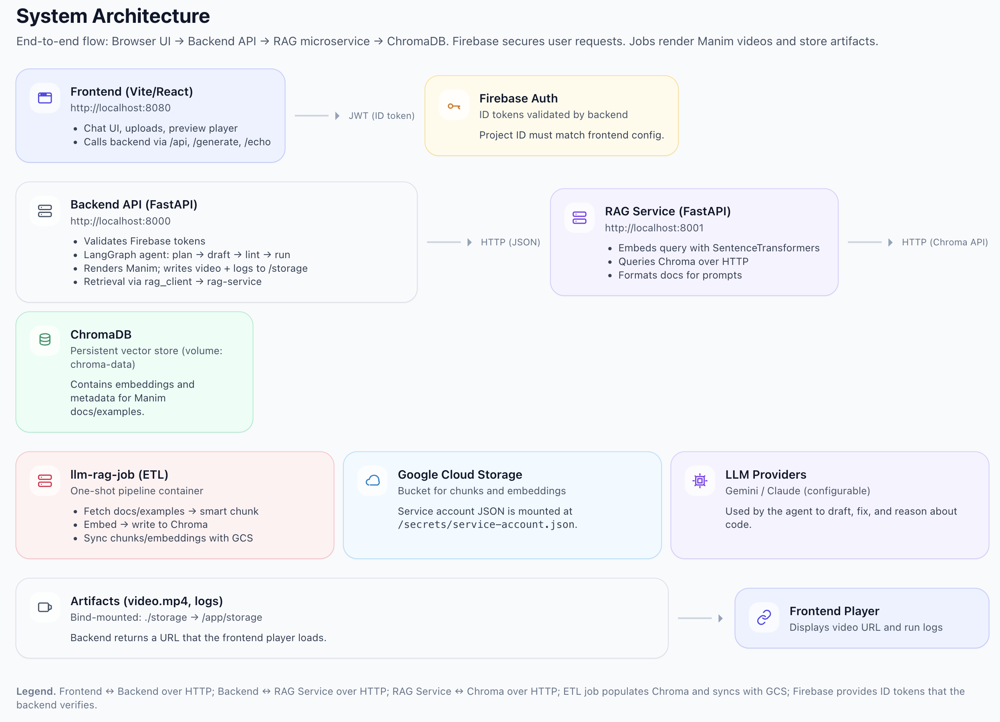

# AC215 Project Group 1

This project builds an AI-powered desktop-first application that generates educational content, including short educational videos, podcasts, and quizzes, from natural language prompts using **LangGraph**, **MCP** and a **Retrieval-Augmented Generation (RAG)** backend.

---

## Overview

Users enter a text prompt or upload a file describing a concept (e.g., "show a circle expanding" or "explain reinforcement learning").  
The backend generates Manim Python code, renders the animation, uses RAG manim documentation on retries, adds voiceover, and returns a playable video.

---

## Repository Structure

```
ac215_Group_1/
├── backend/               # FastAPI app (main API, RAG client, agent logic)
├── frontend/              # React (Vite) UI
├── desktop/               # Electron desktop runtime
├── rag/                   # RAG ETL pipeline + Docker setup
├── img/                   # Architecture diagrams, screenshots
├── pdf/                   # Proposal & reports
├── storage/               # Local output videos (bind-mounted volume)
├── docker-compose.yaml    # Unified compose (frontend, backend, rag, chroma)
└── README.md              # Project overview
```

---

## Containers and Profiles

| Service | Port | Description |
|----------|------|-------------|
| **frontend** | 8080 | React/Vite development server |
| **backend** | 8000 | FastAPI API for generation, rendering, and Firebase auth |
| **rag-service** | 8001 | FastAPI microservice for vector retrieval from ChromaDB |
| **chroma** | 8000 internal | Vector database (embeddings store) |
| **llm-rag-job** | — | One-shot ETL: fetch, preprocess, embed, upload/download to GCS |



Profiles group services for flexible startup:

```bash
# Run backend + rag stack
docker compose --profile backend --profile rag up -d

# Include frontend
docker compose --profile frontend --profile backend --profile rag up -d
```

---

## Environment Setup

- **Frontend:** requires Firebase web configuration (`frontend/.env`)
- **Backend:** uses same Firebase project (for token verification) and optional GCP key (`rag/secrets/service-account.json`)
- **RAG:** reads `.env` in `rag/` for GCS bucket info and paths

See `frontend/.env.example` and `rag/.env.example` for templates.

## RAG Architecture Summary

The RAG system consists of three coordinated components:

1. **ChromaDB (chroma)** – a vector database that stores embeddings of Manim documentation and example scenes.

2. **llm-rag-job** – a one-shot ETL (Extract–Transform–Load) container that builds embeddings from source repositories, stores them in ChromaDB, and optionally uploads/downloads them to a GCS bucket for persistence.

3. **rag-service** – a FastAPI microservice that queries ChromaDB for semantically relevant documents and exposes them via an HTTP API for the main backend to consume.

- Within the main backend, the rag_client module automatically connects to the rag-service microservice to retrieve relevant context during code generation.

- **Data versioning:** RAG embeddings are versioned on GCS with per-version manifests. See [`rag/README.md`](docs/DATA_VERSIONING.md) for details.
---

## Quick Start
### Desktop Start (Recommended)

```bash
# From repo root
npm install
npm --prefix frontend install
npm run desktop:dev
```

Desktop mode runs locally:
- backend at `127.0.0.1:8000`
- frontend at `127.0.0.1:8080`
- Electron window as the app shell

### Containerized Start (Optional Web Stack)

```bash
# Clone
git clone https://github.com/isabelayepes/ac215_Group_1.git
cd ac215_Group_1

# Build and run (backend + rag + frontend)
docker compose --profile frontend --profile backend --profile rag up -d --build

# Stop all
docker compose down
```

Visit **http://localhost:8080** to open the web app.

--- 

## Kubernetes

Kubernetes deployment has been removed from this repository to keep the project local-first and cost-free to run.

## License

This repository is currently unlicensed and private.

All rights reserved © 2025 Isabela Yepes, Manasvi Goyal, Nico Fidalgo.

Access is granted only to authorized course staff for evaluation purposes.
