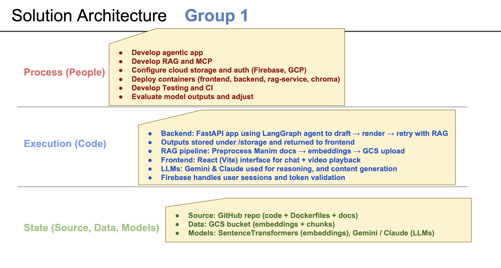
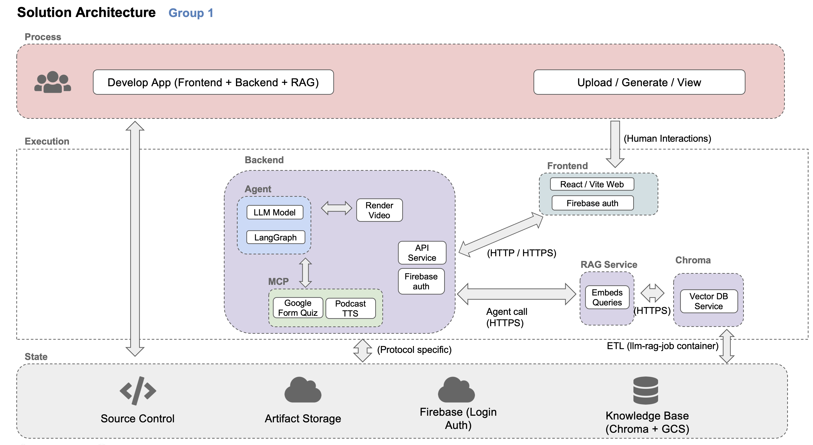
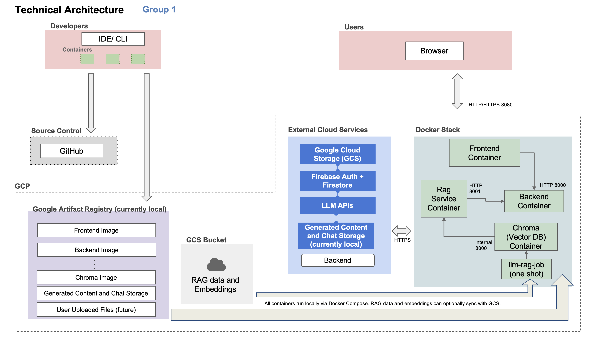

# Application Design Document
**AC215 Group 1**  
**Contributors:** Isabela Yepes, Manasvi Goyal, Nico Fidalgo  
**Date:** November 2025  

---

## 1. Overview

This document outlines the architecture and design of the project, an application that enables users to create educational videos, podcasts, and quizzes using natural language prompts. The system integrates **Manim**, **LangGraph**, **Retrieval-Augmented Generation (RAG)**, and **Model Context Protocol (MCP)** to generate and render accurate, contextually relevant visualizations and multimedia content.

The design follows a **microservice-based architecture** deployed via Docker Compose, supporting modular scaling and future cloud migration to Google Cloud Run and Compute Engine.

---

## 2. Solution Architecture

*(Refer to Slide 1 — Solution Architecture)*


The system is organized across three conceptual layers:

- **Process (People):** Involves developing the agentic app, configuring cloud storage and authentication, container deployment, and model evaluation.  
- **Execution (Code):** Core components include the FastAPI backend (using LangGraph for orchestration), frontend (React + Vite), and the RAG pipeline (ChromaDB + FastAPI microservice).  
- **State (Source, Data, Models):** Persistent storage for code, embeddings, and models using GitHub, Google Cloud Storage (GCS), and SentenceTransformers.

### Summary of Key Components
| Layer | Description |
|--------|-------------|
| **Backend** | FastAPI + LangGraph agent that drafts, renders, and retries with RAG |
| **Frontend** | React (Vite) interface with Firebase authentication |
| **RAG Pipeline** | Preprocesses Manim documentation, builds embeddings, and uploads to GCS |
| **LLMs** | Claude or other model (future work) can be used for reasoning, planning, and generation |
| **State Storage** | GCS bucket + local volumes for embeddings and model artifacts |

---

## 3. Solution Architecture Diagram

*(Refer to Slide 2 — System Components Diagram)*


The architecture is divided into three major layers:

1. **Frontend:** Provides the user-facing interface for chat, prompts, and video playback. Integrates Firebase for login and session management.
2. **Backend:** Implements the FastAPI service for orchestration, rendering, and retrieval coordination. Uses LangGraph for multi-step generation.
3. **RAG Subsystem:** Comprises a separate FastAPI microservice (`rag-service`) and a persistent ChromaDB vector database.
4. **External Services:** Firebase handles authentication and Firestore metadata. GCS stores generated outputs and embeddings.

### Component Interactions
- The frontend communicates with the backend via HTTPS REST APIs.
- The backend authenticates users via Firebase and communicates with RAG for retrieval.  
- RAG queries ChromaDB for relevant Manim code or documentation.  
- Rendered videos are currently stored locally or uploaded to GCS, and URLs are sent back to the frontend.  

---

## 4. Technical Architecture

*(Refer to Slide 3 — Technical Architecture)*


The application stack includes both local development and cloud-ready infrastructure.  
All containers communicate through Docker networks, with optional cloud storage integration.

### **Containers and Services**
| Service | Port | Description |
|----------|------|-------------|
| **frontend** | 8080 | React development server |
| **backend** | 8000 | FastAPI app for orchestration and rendering |
| **rag-service** | 8001 | Microservice handling RAG queries |
| **chroma** | internal 8000 | Vector database storing embeddings |
| **llm-rag-job** | — | One-shot ETL job for preprocessing and uploading data |

### **Data Flow**
1. Developers manage source code on GitHub and build images locally (Docker).  
2. The RAG pipeline generates embeddings and uploads them to GCS.  
3. Containers run locally through Docker Compose (or future Cloud Run deployment).  
4. The backend invokes RAG queries, renders videos, and saves them under `/storage` or GCS.  
5. The frontend displays results and manages user interactions.  

### **External Cloud Services**
- **Firebase Auth + Firestore:** Secure authentication and user data management.  
- **GCS:** Storage for embeddings, outputs, and uploaded assets (future work).  
- **LLM APIs:** Claude currently supported for reasoning, text planning, and quiz generation.  

---

## 5. Code Organization

```
ac215_Group_1/
├── backend/               # FastAPI app + LangGraph agent + MCP endpoints
├── frontend/              # React app (Vite + Firebase integration)
├── rag/                   # RAG pipeline, Docker setup, GCS sync
├── img/                   # Diagrams and visuals
├── pdf/                   # Reports
├── storage/               # Rendered video outputs (mounted volume)
└── docker-compose.yaml    # Unified container orchestration file
```

### **Design Principles**
- **Microservices:** Independent services for frontend, backend, and retrieval.  
- **Containerization:** Uniform environment for local and cloud execution.  
- **Stateless APIs:** Services rely on GCS/Firestore for persistence.  
- **Extensibility:** RAG, agent logic, and model orchestration are decoupled for modular scaling.  

---

## 6. Future Considerations

- Deploy backend and rag-service to **Google Cloud Run** for scalability.  
- Host ChromaDB on **Compute Engine** with a persistent disk.  
- Add Firebase Hosting or Vercel deployment for the frontend.  
- Integrate streaming updates (WebSockets) for generation progress.  
- Expand the RAG index with additional knowledge bases (ie. user uploaded files).

---